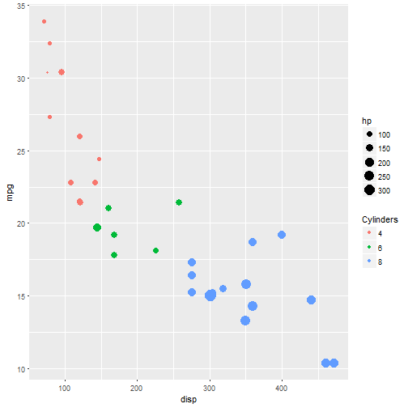

Data Products Presentation
Shiny Application and Reproducible Pitch
========================================================
author: Claus Walter
date: 16.03.2017
autosize: true

Application Purpose
========================================================

As part of the Coursera Data Science Specialization, an application has been created using Shiny. The application allows to analyze the miles per gallon (MPG) key performance indicator against factors such as weight for a given set of cars
- **Data Basis:** mtcars, with allowing for analyzing main attributes mentioned above
- **Filtering Data:** the sidebar panel of the applcation allows for filterning for mpg, transmission type and cylinders 
- **2D plots:** Two 2D plots show mpg vs. weight and displacement for filtered data
- **3D plot:** Combines the 2D plot information in a 3D plot
- **List of selected cars:** Displays the selected car entries
- **Stats for selected cars:** Displays means etc. per attribute
Sample Stats the Application will provide
========================================================
Below an example of the stats displayed based on the selected cars. Note that the layout is more sophisticated in the application, but cannot be displayed accordingly in this presentation for technical reasons:

```
      mpg             disp      
 Min.   :10.40   Min.   : 71.1  
 1st Qu.:15.43   1st Qu.:120.8  
 Median :19.20   Median :196.3  
 Mean   :20.09   Mean   :230.7  
 3rd Qu.:22.80   3rd Qu.:326.0  
 Max.   :33.90   Max.   :472.0  
```
Sample Plots the Apllication will provide
========================================================
The two dimensional plots look roughly like the following examples, with mpg vs. displacement resp. weight, color representing number of cylinders, size of the dots the horse powers:


Where to find the Application, the Code etc.
========================================================

Here you can find the various elements of application components and accompanying elements: 

- **The application:** <https://clauswalter.shinyapps.io/DataProductsWeek3/>

- **R-files et al.:** <https://github.com/ClausWalter/DataProducts>

- **This presentation:** <http://rpubs.com/ClausWalter/ShinyDataProducts>

